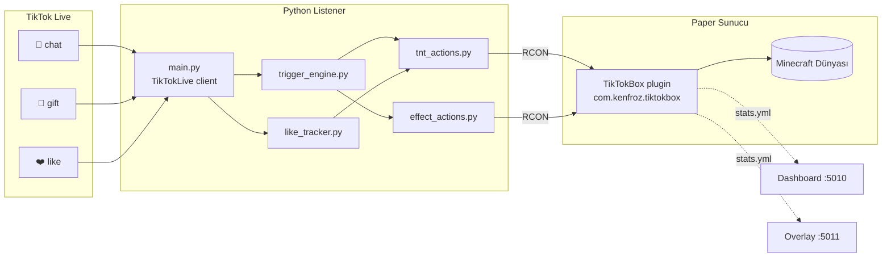

# TikTok Box

> TikTok canlı yayın chat'ini ve hediyelerini, Minecraft içindeki interaktif bir TNT arenasına bağlayan tamamen yerel çalışan bir sistem.

[streamtoearn.io](https://streamtoearn.io/) ücretli sürümüne **ücretsiz, açık kaynak ve özelleştirilebilir** bir alternatif. Yayıncı; demir → altın → elmas tier'larıyla cam havuzu doldurmaya çalışır, izleyici ise chat'ten yazdığı kelimeler ve gönderdiği hediyelerle TNT düşürerek ya da büyü atarak sabotaj yapar.

```
TikTok Live ──► Python listener ──► RCON ──► Paper sunucu + plugin ──► Minecraft
   chat/gift           (events)                (commands)                   (world)
```

---

## İçindekiler

- [Özellikler](#özellikler)
- [Mimari](#mimari)
- [Gereksinimler](#gereksinimler)
- [Kurulum](#kurulum)
- [Çalıştırma](#çalıştırma)
- [Tetikleyiciler](#tetikleyiciler)
- [Oyun İçi Komutlar](#oyun-içi-komutlar)
- [CLI Test Araçları](#cli-test-araçları)
- [OBS Overlay & Dashboard](#obs-overlay--dashboard)
- [Konfigürasyon](#konfigürasyon)
- [Proje Yapısı](#proje-yapısı)
- [Sorun Giderme](#sorun-giderme)
- [Geliştirme](#geliştirme)
- [Lisans](#lisans)

---

## Özellikler

### Oyun Mekaniği
- **Arena:** 16×16×15 = **3840 blok** havada cam kutu (y = 51–65)
- **3 Tier:** Alt 5 sıra demir → orta 5 altın → üst 5 elmas
- **Otomatik dönüşüm:** Arenaya hangi bloğu koyarsan koy, ait olduğu tier materyaline çevrilir
- **Cam duvarlar** kırılamaz / yerleştirilemez / patlatılamaz (plugin koruması)
- **Kazanma:** Arena %100 dolunca 10 sn geri sayım başlar. Bir blok bile gitse iptal. Sıfıra inerse **zafer** → arena otomatik boşalır → yeni tur
- **Bloklardan item drop yok**

### TNT Tier'ları (arenaya yukarıdan düşer, üstünde göndericinin adı yazar)
| Tier | Güç / Davranış | Ana Tetikleyici |
|---|---|---|
| **Normal** | ~4 blok patlama | `tnt` / `bomba` / `patlat` / 1–4 💎 |
| **Mega** | ~7 blok patlama | `mega` / GG / Ice Cream Cone / 20–99 💎 |
| **Yağmur** | 20 TNT yüksekten dağılır | `yagmur` / Perfume / Doughnut / 100–299 💎 |
| **Creeper** | TNT → 6 creeper → 3sn dolaş → patla | `creeper` / `cripper` / Gaming Keyboard |
| **Nükleer** | ~12 blok merkez patlaması | `nuke` / Lion / 500–799 💎 |
| **Meteor** | 50 ateş topu yağar, blok kırar ve yakar | `meteor` / Train / 800–1499 💎 |

### ❤️ Like Bazlı Otomatik TNT Yağmuru
Yayın boyunca kümülatif beğeniler eşiğe ulaştığında otomatik tetiklenir:

| Beğeni | TNT |
|---|---|
| 1.000 | 10 |
| 5.000 | 20 |
| 10.000 | 50 |
| 20.000 | 100 |
| 20k sonrası her **+50k** (70k, 120k, 170k…) | 100 |

### Büyüler (Status Effect)
| Anahtar | Etki | Süre |
|---|---|---|
| `kor` | Blindness | 4 sn |
| `bulanti` / `sarhos` | Nausea | 6 sn |
| `yavas` | Slowness V | 6 sn |
| `ucus` / `levitate` | Levitation | 3 sn |
| `ters` (Rosa hediyesi) | Darkness + Glowing | 5 sn |
| `hiz` | Speed II (pozitif) | 5 sn |
| `mega_sabotaj` (300–499 💎) | Kör + Yavaş + Bulantı kombo | 6 sn |
| `combo_nuke` (Galaxy hediyesi) | 4'lü felaket kombosu | 10 sn |

### 🔒 Ceza Sistemi (yüksek değerli hediyelerde)
| Hediye / Eşik | Aksiyon | Süre |
|---|---|---|
| 1500–2499 💎 | **Hapis** — yayıncı 3×3 bedrock hücreye TP | 10 sn |
| 2500–4999 💎 | **Gauntlet** — 14×14 arena + 4 zombi, demir kılıç & zırh ile hayatta kalma | 30 sn |
| TikTok Universe / Sports Car / 5000+ 💎 | **Wipe** — arena tamamen sıfırlanır | anlık |

### 🤖 Yardımcı Bot Sistemi
- **Her hediyede** gönderenin adıyla bir yardımcı bot spawn olur
- Bot; arenaya yaklaşır, tier sırasına göre boş blokları tek tek doldurur (state machine: IDLE → MOVING → PLACING → WAITING)
- Spectator mode ile bot POV'una geçilebilir (`/arena bot watch`)
- Maksimum 20 aktif bot (FIFO ile en eski silinir)
- Knockback ve hasara karşı bağışık; sunucu restart'ında otomatik temizlenir

### Kalıcı İstatistikler (`server/plugins/TikTokBox/stats.yml`)
- Toplam zafer sayısı (restart'a dayanıklı)
- Top 10 hediye gönderen (kullanıcı → toplam coin)

### Sağda Sabit HUD (Scoreboard Sidebar)
```
★ TikTok Box ★
◆ Kazanma: 7
◆ Doluluk: %63
⏱ Zafere: 8s     ← countdown aktifken
──────────────
❤ Top 5 Hediye
1. user1   1500
2. user2    800
...
```

### Performans Ayarları (plugin onEnable'da otomatik)
- Phantom / patrol / tüccar / raid spawn kapalı
- `mobGriefing = false` — creeper/meteor patlasa bile duvarları kırmaz
- `randomTickSpeed = 0` (bitki büyümesi, leaf decay yok)
- `doFireTick`, `doTileDrops`, `doEntityDrops`, `doDaylightCycle`, `doWeatherCycle` kapalı
- Gün ortası, açık hava sabit
- Doğal mob spawn açık (`difficulty=easy` — creeper tier için şart)

---

## Mimari



**Roller:**
- **Python listener** TikTok event'lerini yakalar, `TriggerEngine` ile keyword/gift kurallarına çevirir, per-user + global cooldown uygular
- **RCON köprüsü** (`rcon_client.py`) thread-safe, otomatik reconnect
- **Paper plugin** TNT scoreboard tag'lerini (`box_normal`, `box_nuke`, vb.) okuyup `ExplosionPrimeEvent`'te güç/yangın override eder; arenayı 10 tickte bir tarar; HUD, ceza ve bot sistemini yürütür

---

## Gereksinimler

| Bileşen | Sürüm |
|---|---|
| OS | Windows 10 / 11 |
| **Java (sunucu runtime)** | **25** (Eclipse Adoptium / Temurin) |
| **Java (plugin build)** | **21+** (pom.xml `release=21`) |
| Python | 3.11+ (3.14'te test edildi) |
| Apache Maven | 3.9+ (plugin derlemek için — repo'ya dahil değil, kendin indir) |
| Minecraft Client | TLauncher veya Java Edition 1.21.11 |
| TikTok | Canlı yayın yapabilen hesap |
| Paper Server | 1.21.11 (`paper.jar` repo'ya dahil değil — [papermc.io](https://papermc.io/downloads/paper)'dan indir) |

---

## Kullanılan Paketler & Kütüphaneler

### Java (Plugin) — Paper API üzerinden gelir
| Paket | Sürüm | Rol |
|---|---|---|
| **[Paper API](https://docs.papermc.io/paper/dev/getting-started/paper-plugins/)** | `1.21.11-R0.1-SNAPSHOT` | Sunucu API (Bukkit/Spigot superset) |
| **[Adventure (kyori)](https://docs.advntr.dev/)** | bundled | `Component`, `Title`, `Sound` — tellraw ve title sistemleri |
| **net.kyori.adventure.text** | bundled | Renkli/biçimli mesajlar (`NamedTextColor`, `TextDecoration`) |
| **org.bukkit.scheduler** | bundled | `BukkitRunnable` — async/timer task yönetimi |
| **org.bukkit.attribute** | bundled | Player attribute override (block_reach, mining_efficiency, vb.) |
| **bStats** (opsiyonel, Paper otomatik) | — | Plugin telemetri (kullanıcı opt-out edebilir: `server/plugins/bStats/config.yml`) |

> Maven `pom.xml`'de yalnızca `paper-api` dependency'si var (scope: `provided`). Hiçbir gölgelenmiş (shaded) external lib yok — `.jar` küçük ve temiz.

### Python (Listener + Dashboard + Overlay)
| Paket | Sürüm | Rol |
|---|---|---|
| **[TikTokLive](https://pypi.org/project/TikTokLive/)** | `>=6.4.0` | TikTok canlı yayın WebSocket client (chat / gift / like event'leri) |
| **[mcrcon](https://pypi.org/project/mcrcon/)** | `>=0.7.0` | Minecraft RCON protokol client'ı |
| **[Flask](https://flask.palletsprojects.com/)** | `>=3.0.0` | Dashboard (port 5010) + Overlay sunucu (port 5011) HTTP server |
| **[PyYAML](https://pyyaml.org/)** | `>=6.0` | `stats.yml` okuma (top gifters listesi) |

Yerleşik (Python stdlib): `asyncio`, `threading`, `queue`, `subprocess`, `socket`, `json`, `pathlib`, `re`, `time`, `random`, `signal`, `logging`.

### Build & Runtime Araçları
| Araç | Rol |
|---|---|
| **[Apache Maven](https://maven.apache.org/)** 3.9+ | Plugin derleme (`mvn clean package`) |
| **[Eclipse Temurin](https://adoptium.net/) JDK 25** | Sunucu runtime (`server/start.bat` içinde JAVA_HOME) |
| **[Paper](https://papermc.io/)** 1.21.11 | Minecraft sunucu yazılımı (Aikar GC flags ile) |
| **[OBS Studio](https://obsproject.com/)** (opsiyonel) | Browser Source ile overlay'leri yayına ekleme |

---

## Kurulum

> Repo binary dosyaları içermez (paper.jar, maven, venv, world). Aşağıdaki adımları sırasıyla takip et.

### 1) Repo'yu klonla
```batch
git clone https://github.com/<kullanici>/minecraft-box-tiktok-live-chat.git
cd minecraft-box-tiktok-live-chat
```

### 2) Java 25 (sunucu runtime) yükle
[Eclipse Adoptium / Temurin JDK 25](https://adoptium.net/) → kur, ardından:
```batch
setx JAVA_HOME "C:\Program Files\Eclipse Adoptium\jdk-25.0.2.10-hotspot"
```
Kendi yolunu `server/start.bat` içindeki `JAVA_HOME` satırına yansıt.

### 3) Apache Maven indir
[maven.apache.org/download](https://maven.apache.org/download.cgi) → `apache-maven-3.9.x-bin.zip` indir, repo kökünde `tools/apache-maven-3.9.9/` olacak şekilde aç **veya** sistem `PATH`'ine ekle (`mvn` çalışır olsun).

### 4) Paper sunucu jar'ını indir
[papermc.io/downloads/paper](https://papermc.io/downloads/paper) → 1.21.11 build → indir → `server/paper.jar` olarak kaydet.

İlk çalıştırmada `eula.txt` üretilir; `eula=true` olarak güncelle (Mojang EULA'yı kabul ettiğin anlamına gelir).

### 5) Python venv + bağımlılıklar
```batch
cd python
python -m venv venv
venv\Scripts\pip install -r requirements.txt
cd ..
```

### 6) Plugin'i derle ve sunucuya kopyala
```batch
cd plugin
..\tools\apache-maven-3.9.9\bin\mvn.cmd clean package
:: ya da global maven yüklediysen sadece: mvn clean package
copy /Y target\TikTokBox-1.0.0.jar ..\server\plugins\
cd ..
```

### 7) İlk başlatma (dünya oluşur)
```batch
cd server
start.bat
:: konsola "Done" yazıldığında /stop ile kapat
```

### 8) Kişisel ayarlar
- **TikTok kullanıcı adın:** `python/config/arena.json` → `tiktok.username`
- **RCON şifresi:** `server/server.properties` → `rcon.password` **ve** `python/config/arena.json` → `rcon.password` **aynı** olmalı (default: `tiktokbox123` — **mutlaka değiştir**)
- **OP olarak kendini ekle:** sunucu konsolundan `/op <kullanici_adin>`
- **Arena koordinatları:** `python/config/arena.json` (Python tarafı) **ve** `server/plugins/TikTokBox/config.yml` (plugin tarafı) — **iki dosyada da senkron tut**

### 🔐 Güvenlik Notları
- `rcon.password` default `tiktokbox123` — **production öncesi mutlaka rastgele uzun bir değerle değiştir** (RCON, sunucuda OP komutu çalıştırma yetkisi verir)
- `server.properties` içindeki `online-mode=false` cracked client desteği için açık — **public sunucu açacaksan `true` yap**, aksi halde herkes herhangi bir Minecraft kullanıcı adıyla bağlanabilir
- `.gitignore` ops.json, usercache.json, banned-*.json, world/ ve log dosyalarını dışarıda tutar — fork ediyorsan bu listeyi silme
- Bu sistem **localhost'a bağımlı** çalışır; uzaktan erişim açacaksan RCON portunu (25575) firewall'la kapatmayı unutma

---

## Çalıştırma

### Tek komutla tüm stack (önerilen)
```batch
cd C:\Projects\minecraft-box-tiktok-live-chat\python
launch.bat
```
`launch.py` üç bileşeni ayrı pencerelerde başlatır, server RCON'u dinleyene kadar bekler ve Ctrl+C'de hepsini düzgünce kapatır (dünya kaydedilir):

| Bileşen | Adres |
|---|---|
| Minecraft sunucu | `localhost:25565` |
| Dashboard (Flask) | `http://127.0.0.1:5010` |
| OBS Overlay sunucu | `http://127.0.0.1:5011` |

### Manuel
```batch
:: Pencere 1
server\start.bat

:: Pencere 2 — RCON hazır olduktan sonra
python\run.bat

:: Pencere 3 (opsiyonel)
python\dash.bat
```

### Tipik yayın akışı
1. Sunucu açık, listener bağlı
2. TLauncher'dan `localhost:25565`'e bağlan, kullanıcı adın `kenfroz` (veya OP eklediğin isim)
3. TikTok'tan canlı yayını aç
4. İzleyiciler chat'e `tnt`, `kor`, `mega` yazsın → arena dolup sabotajla bozulmaya başlar

> Yayın kapalıyken listener 30 saniyede bir yeniden bağlanmayı dener.

---

## Tetikleyiciler

Tüm tetikleyiciler tek tabloda. `—` işareti o kanaldan tetiklenemez demektir.

| Aksiyon | Chat | Hediye (by name) | Elmas aralığı | Like (kümülatif) | Cooldown (per user / global) |
|---|---|---|---|---|---|
| Normal TNT | `tnt` `bomba` `patlat` | Rose, Finger Heart | 1–4 | — | 3sn / 0.5sn |
| Mega TNT | `mega` | GG, Ice Cream Cone | 20–99 | — | 15sn / 2sn |
| TNT Yağmuru | `yagmur` | Perfume, Doughnut | 100–299 | 1k→10, 5k→20, 10k→50, 20k→100, +50k→100 | 30sn / 5sn |
| Creeper Sürüsü | `creeper` `cripper` | Gaming Keyboard | — | — | 20sn / 3sn |
| Nükleer | `nuke` | Lion | 500–799 | — | 60sn / 10sn |
| Meteor | `meteor` | Train | 800–1499 | — | 120sn / 20sn |
| Mega Sabotaj | — | — | 300–499 | — | — |
| Hapis (10sn) | — | — | 1500–2499 | — | — |
| Gauntlet (30sn) | — | — | 2500–4999 | — | — |
| **Arena Wipe** | — | TikTok Universe, Sports Car | **5000+** | — | — |
| Körlük | `kor` | — | 5–19 | — | 45sn / 8sn |
| Bulantı | `bulanti` `sarhos` | — | — | — | 45sn / 8sn |
| Yavaşlık V | `yavas` | — | — | — | 45sn / 8sn |
| Levitation | `ucus` `levitate` | — | — | — | 90sn / 20sn |
| Darkness + Glow | `ters` | Rosa | — | — | 60sn / 15sn |
| Speed II | `hiz` | — | — | — | 60sn / 15sn |
| Combo Nuke (Felaket) | — | Galaxy | — | — | — |

**Notlar**
- `by_name` hediye eşleşmesi elmas aralığı eşleşmesinden **önceliklidir**
- Like eşikleri yayın başına **bir kez** tetiklenir
- TNT/meteor/creeper'ın üzerinde göndericinin adı yazar
- Per-user + global cooldown spam'i engeller

---

## Oyun İçi Komutlar

`/arena <subcommand>` — `tiktokbox.admin` permission gerekir (default: OP).

### Arena
| Komut | Açıklama |
|---|---|
| `/arena status` | Doluluk %, win sayısı, countdown durumu |
| `/arena clear` (alias: `reset`) | Arenayı tamamen temizle |
| `/arena fill [pct\|tier]` | %N doldur **veya** tier ismiyle (`iron`/`gold`/`diamond`) doldur |
| `/arena win` | Arenayı tam dolu state'e getir (countdown başlar) |
| `/arena tnt <tier>` | Test TNT: `normal` / `mega` / `rain` / `creeper` / `nuke` / `meteor` |
| `/arena cleartnt` | Aktif TNT'leri sil |
| `/arena inv` | Envanteri yenile (3 tier blok + stone bricks + TNT) |
| `/arena tp` | Arena yanına ışınlan |
| `/arena speed <n>` | Block break / mining / attack speed attribute'larını `n`'e set et |
| `/arena hud` | Scoreboard HUD'unu yeniden göster |

### İstatistik
| Komut | Açıklama |
|---|---|
| `/arena wins` | Toplam zafer sayısı |
| `/arena gift <user> <coins>` | Top 10'a kayıt ekle (Python otomatik çağırır) |
| `/arena cleargifters` | Top 10'u sıfırla |

### Ceza
| Komut | Açıklama |
|---|---|
| `/arena penalty prison [user]` | Hapis hücresine at (10 sn) |
| `/arena penalty gauntlet [user]` | Gauntlet'e at (30 sn, 4 zombi) |
| `/arena penalty end [user]` | Cezayı manuel sonlandır, oyuncuyu geri TP |

### Bot
| Komut | Açıklama |
|---|---|
| `/arena bot start [bps] [tip] [isim]` | Yardımcı bot spawn et (max 20) |
| `/arena bot summon <isim>` | Yeni bot çağır (gönderici adıyla) |
| `/arena bot stop` | Tüm botları kapat |
| `/arena bot status` (alias: `list`) | Aktif botları listele |
| `/arena bot watch [user]` | Spectator POV'a geç (en son bota fokus) |
| `/arena bot unwatch [user]` | POV'dan çık |

### Bakım
| Komut | Açıklama |
|---|---|
| `/arena rebuild [legacy_size]` | Eski boyut artıklarını temizle, yeni inner bounds'a duvar kur |
| `/arena walls` | Arena çevresindeki **tüm** wall material bloklarını sil ve yeniden inşa et |

---

## CLI Test Araçları

`python\t.bat` ile RCON üzerinden hızlı test:

```bash
t tnt normal              # tek normal TNT
t tnt nuke                # nükleer
t spam tnt 20             # 20 normal TNT art arda
t gift Rose 1 50          # Rose x50 simülasyonu
t gift Galaxy 1000 1      # Galaxy → combo_nuke
t effect blindness        # körlük
t effect combo_nuke       # felaket kombosu
t chat kenfroz tnt        # chat mesajı simüle
t fill 80                 # arenayı %80 doldur
t win                     # arena tam dolu
t clear                   # arenayı temizle
t inv / t tp              # envanter / ışınlan
t say merhaba             # oyun chat'ine yaz
t help                    # tüm komutlar
```

---

## OBS Overlay & Dashboard

### OBS Browser Source — `http://127.0.0.1:5011`
Şeffaf, SSE tabanlı canlı overlay'ler:

| Endpoint | Ne gösterir |
|---|---|
| `/feed` | Son TNT/effect/gift olayları akışı |
| `/likes` | Like progress bar + bir sonraki eşik |
| `/alerts` | Büyük hediyelerde ortada flash |
| `/gifters` | Top 5 hediye liderlik tablosu |
| `/stream` | Ham SSE event kanalı |
| `/state` | JSON snapshot (debug) |

### Dashboard — `http://127.0.0.1:5010`
Yerel yönetim panosu (`dashboard.py`, Flask). Arena durumu, TNT/effect tetikleyici butonları, top gifters tablosu, listener health.

---

## Konfigürasyon

### `python/config/arena.json` — koordinatlar, RCON, like eşikleri
```json
{
  "arena": {
    "inner_min": { "x": 0, "y": 51, "z": 0 },
    "inner_max": { "x": 15, "y": 65, "z": 15 },
    "wall_material": "minecraft:glass",
    "tiers": [
      { "name": "iron",    "y_min": 51, "y_max": 55, "block": "minecraft:iron_block" },
      { "name": "gold",    "y_min": 56, "y_max": 60, "block": "minecraft:gold_block" },
      { "name": "diamond", "y_min": 61, "y_max": 65, "block": "minecraft:diamond_block" }
    ]
  },
  "rcon":   { "host": "127.0.0.1", "port": 25575, "password": "tiktokbox123" },
  "tiktok": { "username": "your_username" },
  "likes": {
    "thresholds": [
      { "at": 1000,  "tnt": 10  },
      { "at": 5000,  "tnt": 20  },
      { "at": 10000, "tnt": 50  },
      { "at": 20000, "tnt": 100 }
    ],
    "post_interval": 50000,
    "post_count": 100
  }
}
```

### `python/config/triggers.json` — keyword & hediye kuralları
Yeni keyword eklemek:
```json
{
  "keywords": {
    "yeni_keyword": {
      "action": "tnt",
      "tier": "mega",
      "cooldown_per_user_sec": 30,
      "global_cooldown_sec": 5.0
    }
  }
}
```

### `server/plugins/TikTokBox/config.yml` — plugin runtime
Arena boyutları, TNT güçleri, oyuncu attribute'ları, countdown süresi, ceza koordinatları, bot ayarları. **Değişiklik için server restart gerekir.**

> ⚠️ Arena koordinatlarını değiştirirsen `arena.json` (Python) ve `config.yml` (plugin) **birlikte** güncellenmeli — aksi halde Python yanlış yere TNT atar.

---

## Proje Yapısı

```
C:\Projects\minecraft-box-tiktok-live-chat\
├── server/                          Paper 1.21.11 + world + plugins
│   ├── paper.jar
│   ├── start.bat                    Java 25 + Aikar flags
│   ├── server.properties            (RCON açık, online-mode=false, difficulty=easy)
│   └── plugins/
│       ├── TikTokBox-1.0.0.jar
│       └── TikTokBox/
│           ├── config.yml
│           └── stats.yml            kalıcı win + top gifters
│
├── plugin/                          Java plugin kaynak (Paper API 1.21.11)
│   ├── pom.xml
│   └── src/main/
│       ├── java/com/kenfroz/tiktokbox/
│       │   ├── TikTokBoxPlugin.java     onEnable, world rules, cleanup
│       │   ├── ArenaConfig.java         config.yml parser
│       │   ├── ArenaMonitor.java        scan + countdown + win loop
│       │   ├── ArenaCommand.java        /arena ... handler
│       │   ├── ProtectionListener.java  duvar koruma + fast place
│       │   ├── DropBlocker.java         item drop engelle
│       │   ├── TNTManager.java          tag-based explosion override
│       │   ├── HudManager.java          scoreboard sidebar
│       │   ├── HudJoinListener.java     join'de HUD göster
│       │   ├── StatsManager.java        wins + top gifters persist
│       │   ├── TierDefinition.java
│       │   ├── PenaltyManager.java      hapis + gauntlet sistemi
│       │   ├── BotPool.java             yardımcı bot havuzu (max 20)
│       │   └── HelperBot.java           tek bot state machine
│       └── resources/
│           ├── plugin.yml
│           └── config.yml
│
├── python/                          Listener + dashboard + overlay
│   ├── main.py                      TikTok client + state writer + overlay thread
│   ├── launch.py / launch.bat       tüm stack'i tek komutla başlat
│   ├── rcon_client.py               thread-safe RCON wrapper
│   ├── trigger_engine.py            keyword/gift → action dispatcher
│   ├── tnt_actions.py               6 TNT seviyesi
│   ├── effect_actions.py            status effects + wipe + jail + gauntlet
│   ├── like_tracker.py              kümülatif like → kademeli TNT
│   ├── overlay_server.py            OBS browser source HTTP+SSE (port 5011)
│   ├── overlay_bus.py               in-process pub/sub
│   ├── dashboard.py / dash.bat      Flask yönetim panosu (port 5010)
│   ├── test.py / t.bat              CLI test araçları
│   ├── run.bat                      sadece listener'ı başlat
│   ├── state.json                   listener health snapshot
│   ├── venv/                        TikTokLive + mcrcon + Flask + PyYAML
│   └── config/
│       ├── arena.json
│       └── triggers.json
│
├── tools/
│   └── apache-maven-3.9.9/          plugin derlemek için
│
└── README.md
```

---

## Sorun Giderme

<details>
<summary><strong>Listener "offline" hatası veriyor</strong></summary>

TikTok hesabın canlı yayında olmalı. Listener 30 saniyede bir yeniden deneyecek; sen yayını açtığında otomatik bağlanır.
</details>

<details>
<summary><strong>TLauncher / Minecraft client bağlanamıyor</strong></summary>

- `server.properties` içinde `online-mode=false` olmalı (cracked client için)
- Port 25565 başka uygulama tarafından kullanılmıyor olmalı
- Tercihen `127.0.0.1:25565` kullan (IPv6 sorun çıkarabiliyor)
</details>

<details>
<summary><strong>Plugin komutları çalışmıyor</strong></summary>

- OP olmalısın: sunucu konsolundan `/op <username>`
- Çakışma varsa `/tiktokbox:arena` ile çağır
- `permissions:` blokunda `default: op` ayarı plugin.yml içinde
</details>

<details>
<summary><strong>Arena doluluk güncellenmiyor / yanlış görünüyor</strong></summary>

- Python `arena.json` ve plugin `config.yml` koordinatları **birebir aynı** olmalı
- Plugin restart'ı `config.yml` değişikliklerini uygular
- `/arena status` ile gerçek değerleri kontrol et
</details>

<details>
<summary><strong>Eski / stray duvar blokları var</strong></summary>

- `/arena walls` komutu arena çevresindeki tüm wall material bloklarını siler ve yeni bounds'a göre yeniden inşa eder
- Eski boyuttan kalan iç tier blokları için: `/arena rebuild [legacy_size]`
</details>

<details>
<summary><strong>Bot çıldırdı / ortalıkta zombie/creeper kaldı</strong></summary>

Sunucu restart'ı `cleanupOrphanEntities` ile şu tag'li tüm entity'leri temizler: `box_helper_bot`, `box_penalty_mob`, `box_creeper_mob`. Manuel:
```
/arena bot stop
/arena penalty end <user>
```
</details>

<details>
<summary><strong>RCON "connection refused"</strong></summary>

- `server.properties`: `enable-rcon=true`, `rcon.port=25575`, `rcon.password=...`
- `arena.json` ile şifre **tam olarak aynı** olmalı
- Server tam başladıktan sonra listener bağlanır (launch.py 180sn timeout ile bekler)
</details>

---

## Geliştirme

### Bağımlılık sürümleri
- Paper API: `1.21.11-R0.1-SNAPSHOT` (https://repo.papermc.io/)
- TikTokLive (Python): 6.4+
- mcrcon (Python): 0.7+
- Flask: 3.0+
- Plugin namespace: `com.kenfroz.tiktokbox`
- Plugin compile target: Java 21
- Server runtime: Java 25
- RCON: `localhost:25575`, default şifre `tiktokbox123` (değiştir!)

### Plugin'i yeniden derle
```batch
cd C:\Projects\minecraft-box-tiktok-live-chat\plugin
..\tools\apache-maven-3.9.9\bin\mvn.cmd clean package
copy /Y target\TikTokBox-1.0.0.jar ..\server\plugins\
:: server restart
```

### Yeni TNT seviyesi ekle
1. `plugin/src/main/resources/config.yml` → `tnt.tiers` altına yeni entry (`power`, `fire`)
2. `python/tnt_actions.py` → `fire()` dispatcher'a yeni `elif tier == "..."`
3. `python/config/triggers.json` → keyword veya hediye eşleştirmesi
4. Plugin rebuild + server restart, Python listener restart

### Yeni büyü ekle
`python/effect_actions.py` → `PRESETS` dict'ine entry ekle (`(effects, label, color)`).
Sadece Python restart yeter, plugin'e dokunma.

### Yeni ceza türü ekle
1. `plugin/.../PenaltyManager.java` → yeni `start...()` method (state snapshot + timer + restore)
2. `plugin/src/main/resources/config.yml` → `penalty.<yeni>` koordinat & süre
3. `plugin/.../ArenaCommand.java` → `handlePenalty` switch'ine ekle
4. `python/effect_actions.py` → RCON ile `arena penalty <yeni>` çağıran method
5. `python/config/triggers.json` → diamond aralığı ekle

### TNT tag akışı
```
Python: summon tnt X Y Z {Tags:["box_meteor"]}
   ↓
Plugin TNTManager.onExplosionPrime(ExplosionPrimeEvent):
   tags.contains("box_meteor") → setRadius(3.5), setFire(true)
                              → destroyArenaBlocks(...)
```

---

## Katkıda Bulunmak

PR ve issue açıklamalarına açığım:
- **Yeni TNT seviyesi / büyü / ceza türü:** [Geliştirme](#geliştirme) bölümündeki adımları takip et
- **Yeni hediye eşlemesi:** sadece `python/config/triggers.json` düzenlemen yeterli
- **Bug raporu:** server konsol logları + `python/state.json` çıktısıyla aç
- **Çeviri:** README'yi başka dile çevirmek istersen `README.<dil>.md` olarak ekle (ör. `README.en.md`)

## Lisans

Kişisel ve yayıncı kullanımı için serbest. Sistemi olduğu gibi kopyalayıp ticari olarak dağıtma. Fork edip kendi kanalın için özelleştirebilirsin.

## Teşekkürler

- [PaperMC](https://papermc.io/) — yüksek performanslı Minecraft sunucu yazılımı
- [TikTokLive](https://github.com/isaackogan/TikTokLive) — Python TikTok WebSocket client
- [mcrcon](https://github.com/Uncaught-Exceptions/MCRcon) — Minecraft RCON Python implementasyonu
- [Aikar](https://aikar.co/) — Paper GC flag'leri
- İlhamı [streamtoearn.io](https://streamtoearn.io/)'dan aldı
